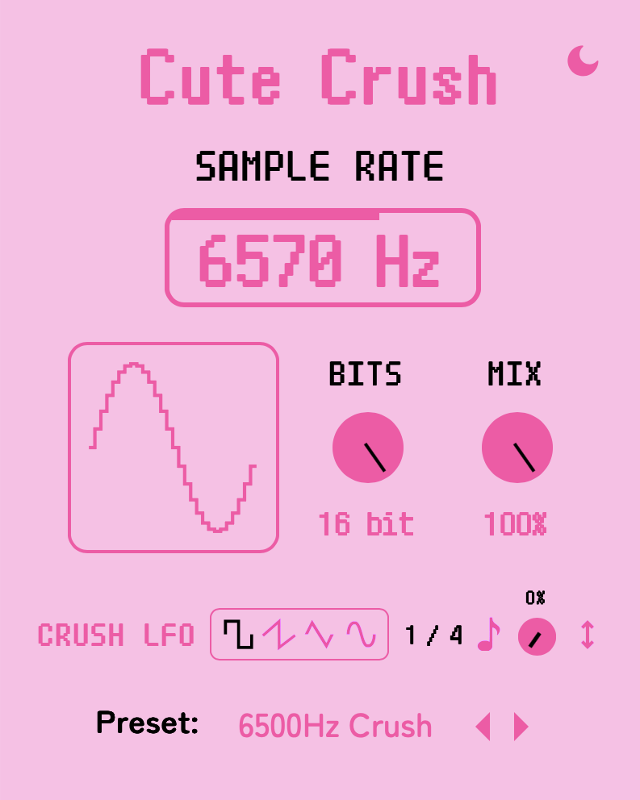

# Cute Crush

Cute Crush is a VST plugin for sample rate reduction and bitcrushing.

### Controls:
- Sample Rate - the sample rate reduction
- Bits - the bit depth reduction
- Mix - the amount of the effect applied
- Crush LFO Waveform - pick from square, sawtooth, triangle, and sine shapes for the crush LFO. 
- Crush LFO Rate - the speed of the crush LFO in bpm synced times.
- Crush LFO Amount - the amount of the crush LFO effect applied.
- Crush LFO Invert - inverts the phase of the crush LFO.

### Design

Our design is available here: https://www.figma.com/design/6nkScNIeA7713z3nRbFWUF/Cute-Crush

### Installation

Download from the [releases](https://github.com/Moebytes/Cute-Crush/releases) tab and rescan the plugins in your DAW.

### See Also

- [Cute Gain](https://github.com/Moebytes/Cute-Gain) 
- [Cute Pitch](https://github.com/Moebytes/Cute-Pitch)